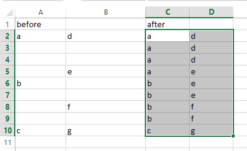
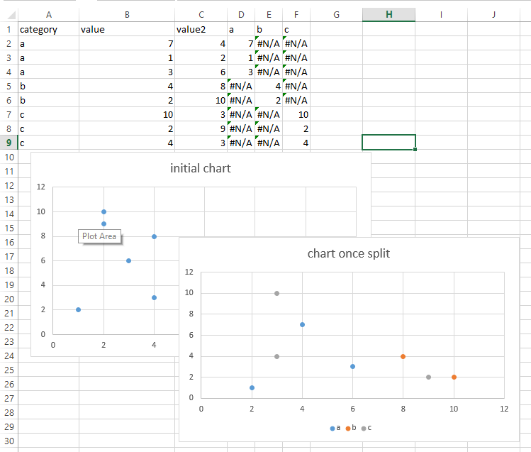

#Advanced Processing
There are several options for doing advanced, purpose built processing.  Most of these are helper macros that were written to do things in other workbooks.  They were then generalized and added into bUTL .  The purpose of these is to perform multiple steps that would be cumbersome or boring to do by hand.  Remember that these were built for specific applications and generalized only slightly.

##Waterfall fill
The waterfall fill works to fill in blank entries between cells with values (going down the sheet).  It can be used to fill in repeated entries at each change.  An example shows it best:

##Series split
The series split option is used to split a column of categorical (or a small number of unique numerical entries) values into separate columns for each value.  This can be used in conjunction with the charting features to produce a chart that has a different series for each category (hence the name).  This feature will add a column for each unique value in the category range so it should only be used if there are a limited number of categories.
Choose the range with the category, included the header
Choose the value range, include the header
Enter a default value.  For charting, #N/A is the best choice.
The output will be a column for each unique value.  It will then only show the value in the column where the category matches

This series split can then be used to create a nice chart with each column in its own series.  This gives a unique color to each category.  The image below shows the new table of data that was added.  The charts were created separately to show the purpose of this.

##Extend array formula
This will extend the current array formula to the same size as the one next to it.  It currently only works to make the formula larger and not smaller.

##Delete hidden rows
This does what it says.  It will delete hidden rows in the current worksheet.  This is useful for filtering on a single value and then deleting all the hidden stuff.  From there, you can clear the filter and only the values you want will remain.  The alternative is usually a harder filter to show the ones you want to delete.

Image shows after a filter and then the delete hidden step (note the change in row numbers).

##Recalculate
This will force a full recalculation of everything in Excel at the moment.  This is the most rigorous recalculation that is possible.
