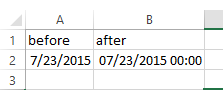
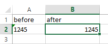
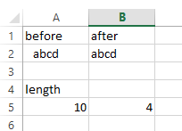

# Formatting Section
This contains set of tools that can be used to provide bulk formatting to the file.  Some of these work on the selection while others work on entire sheets.

##Number format

This applies the number format that is shown to the selected cells.  This is useful for dates.

##Bulk formatting menu
This menu contains options that apply certain formatting procedures to the selected cell or entire sheet.

###To numeric
This converts the entire selection to a number if possible.  When the code runs it does a “IsNumber” check in the code.  This prevents it from making numbers from text.  This is quicker than using the drop down menu that shows up when Excel detects this issue.

###To value
This converts the entire sheet to values.  This includes any formulas or anything else.

###Trim selection
This will remove any spaces or other whitespace at the beginning and end of the cell value.

###To Hyperlink
This will make hyperlinks out of all the cells in the selection.  The links will go to the value that is included in the cell.

##Colorizing menu
This menu contains commands that apply formatting (generally colors) to the selected cells.  These work on the selection.

###Alternate colors
This will color the entire row of the used range so that colors alternate based on the values.  Note that this will color the entire used range based on the values of the selected cells.  It works best it you only select cells from a single column.

**this one needs some attention and will be resolved**

###Categorical coloring
This applies the formatting for a given cell to all cells with the same value in a different range.  This really only works if you have previously applied formatting to unique cells.  It also works best if you have previously filtered out the unique values.  These issues may be surpassed in the future.

